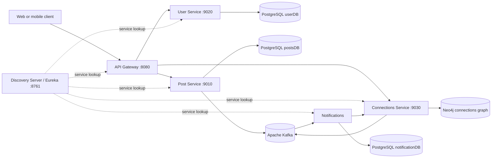

# Sociofy

Sociofy is a backend for a social networking application. Users can create accounts, log in, publish posts, like posts, and build connections with other users. The system also creates notifications when relevant social activity occurs.

The project is implemented as a small microservices system. Each service owns one business capability and its own data store. Services communicate in two ways:

- **Synchronous REST calls** for actions that need an immediate response, such as login or creating a connection request.
- **Asynchronous Kafka events** for side effects, such as creating notifications after a post or connection action.

## What the application does

A typical Sociofy user can:

1. Sign up and receive a user account.
2. Log in and receive a JWT access token.
3. Use the token to create and view posts.
4. Like or unlike posts.
5. Send, accept, or reject connection requests.
6. Receive notifications when connections create posts, posts are liked, or connection requests change state.

## High-level architecture



### Request path

Clients should normally call the API Gateway rather than calling individual services directly. The gateway:

1. Matches the public URL route.
2. Uses Eureka to find the correct service instance.
3. Checks JWT authentication for protected routes.
4. Adds the authenticated user's ID to the `X-User-Id` request header.
5. Forwards the request to the selected service.

User signup and login are public. Post and connection routes require a valid bearer token.

### Event path

Post and connection operations publish events to Kafka after their main work is completed. The notification service listens for those events and stores notification records. This keeps notification work separate from the request that caused it, so the post or connection service does not need to wait for notification persistence.

## Services

| Service | Responsibility | Storage | Internal port |
| --- | --- | --- | ---: |
| `api-gateway` | Public entry point, routing, JWT validation, user ID propagation | None | `8080` |
| `discovery-server` | Eureka service registry | None | `8761` |
| `User-Service` | Signup, login, user records, JWT creation | PostgreSQL `userDB` | `9020` |
| `post-Service` | Create and read posts, like and unlike posts | PostgreSQL `postsDB` | `9010` |
| `connections-service` | Connection requests and first-degree connections | Neo4j | `9030` |
| `notification-service` | Consume social events and save notifications | PostgreSQL `notificationDB` | `9040` |

Service names and folder names use slightly different capitalization in places. The logical service names are the names in the table above and in the Eureka configuration.

## Main API routes

The examples below use the Docker Compose gateway address, `http://localhost:8083`. The gateway listens on port `8080` inside its container and is published as port `8083` on the host.

### Authentication

These routes do not require a token:

```text
POST /api/v1/users/auth/signup
POST /api/v1/users/auth/login
```

`/login` returns a JWT. Send it to protected routes as:

```text
Authorization: Bearer <token>
```

### Posts

These routes require a JWT:

```text
POST   /api/v1/posts/core                         Create a post
GET    /api/v1/posts/core/{postId}                Get one post
GET    /api/v1/posts/core/users/{userId}/allPosts Get all posts by a user
POST   /api/v1/posts/likes/{postId}               Like a post
DELETE /api/v1/posts/likes/{postId}               Unlike a post
```

### Connections

These routes require a JWT:

```text
GET  /api/v1/connections/core/{userId}/first-degree Get first-degree connections
POST /api/v1/connections/core/request/{userId}      Send a connection request
POST /api/v1/connections/core/accept/{userId}       Accept a connection request
POST /api/v1/connections/core/reject/{userId}       Reject a connection request
```

The notification service currently consumes events and stores notification records; it does not expose a gateway route for reading notifications.

## Important workflows

### 1. Signup and login

1. The client sends signup or login credentials to the gateway.
2. The gateway routes the request to `User-Service`.
3. `User-Service` stores users in PostgreSQL and hashes passwords with BCrypt.
4. On successful login, it creates a JWT containing the user ID.
5. The client keeps the token and sends it with later protected requests.

### 2. Creating a post

1. The client sends `POST /api/v1/posts/core` with a bearer token.
2. The gateway validates the token and adds `X-User-Id`.
3. `post-Service` reads the user ID, stores the post in PostgreSQL, and returns the created post.
4. `post-Service` publishes a `post-created-topic` event.
5. `notification-service` consumes the event, asks `connections-service` for the creator's first-degree connections, and stores a notification for each connection.

### 3. Liking a post

1. The authenticated client sends `POST /api/v1/posts/likes/{postId}`.
2. `post-Service` stores the like in PostgreSQL.
3. It publishes a `post-liked-topic` event.
4. `notification-service` consumes the event and stores a notification for the post creator.

### 4. Managing connections

1. The authenticated client sends a connection request, acceptance, or rejection to the gateway.
2. `connections-service` updates the Neo4j relationship graph.
3. For request and acceptance actions, it publishes the corresponding Kafka event.
4. `notification-service` consumes the event and stores a notification for the relevant user.

## Kafka topics

| Topic | Published by | Consumed by | Meaning |
| --- | --- | --- | --- |
| `post-created-topic` | `post-Service` | `notification-service` | A user created a post |
| `post-liked-topic` | `post-Service` | `notification-service` | A user liked a post |
| `send-connection-request-topic` | `connections-service` | `notification-service` | A connection request was sent |
| `accept-connection-request-topic` | `connections-service` | `notification-service` | A connection request was accepted |

The topics are configured with three partitions and one replica in the service code. The Docker Compose setup runs a single Kafka broker, so this is a development-oriented configuration.

## Data stores

Sociofy uses a database-per-service approach:

- **User PostgreSQL database**: user accounts and authentication data.
- **Posts PostgreSQL database**: posts and post likes.
- **Connections Neo4j database**: people and graph relationships between them.
- **Notifications PostgreSQL database**: generated notification messages.

This separation means each service owns its data instead of sharing tables with another service. Cross-service information is obtained through REST/Feign calls or Kafka events.

## Technologies used

### Application

- Java 21
- Spring Boot
- Spring Web / Web MVC
- Spring Data JPA
- Spring Data Neo4j
- Maven
- Lombok
- ModelMapper

### Microservices and security

- Spring Cloud Gateway for routing
- Netflix Eureka for service discovery
- Spring Cloud LoadBalancer for service-to-service routing
- OpenFeign for declarative internal HTTP clients
- JSON Web Tokens (JWT) for authentication
- BCrypt for password hashing
- Spring Boot Actuator for service monitoring endpoints

### Infrastructure

- Apache Kafka for asynchronous events
- PostgreSQL 16 for relational data
- Neo4j for connection relationships
- Docker and Docker Compose for local orchestration

Most services use Spring Boot `3.2.5` and Spring Cloud `2023.0.3`. The notification service currently declares Spring Boot `4.0.5` and Spring Cloud `2025.1.1`, so dependency versions are not fully uniform across the repository.

## Running the project with Docker Compose

### Prerequisites

- Docker Desktop with Docker Compose
- Ports available: `5432`, `5433`, `5434`, `7474`, `7687`, `8083`, `8761`, and `9092`

### Start the infrastructure and services

From the repository root:

```bash
docker compose up -d
```

The Compose file uses pre-built Docker images for the application services. To follow logs:

```bash
docker compose logs -f api-gateway
```

To stop the stack:

```bash
docker compose down
```

To stop it and remove persisted development data:

```bash
docker compose down -v
```

### Useful local addresses

| Component | Address |
| --- | --- |
| API Gateway | `http://localhost:8083` |
| Eureka dashboard | `http://localhost:8761` |
| Neo4j Browser | `http://localhost:7474` |
| Kafka broker | `localhost:9092` |
| User PostgreSQL | `localhost:5434` |
| Posts PostgreSQL | `localhost:5433` |
| Notifications PostgreSQL | `localhost:5432` |

## Running a service directly with Maven

Each service is an independent Maven project. From a service directory, run:

```bash
./mvnw spring-boot:run
```

On Windows PowerShell, use:

```powershell
.\mvnw.cmd spring-boot:run
```

For a packaged build:

```powershell
.\mvnw.cmd clean package
```

When running services outside Docker, update the database, Kafka, and Eureka hostnames in the relevant `application.properties` or `application.yml` files. The checked-in configuration primarily uses Docker Compose service names such as `user-db`, `kafka`, and `discovery-server`.

## Repository structure

```text
Sociofy/
├── api-gateway/          Public gateway and JWT filter
├── discovery-server/     Eureka service registry
├── User-Service/         Authentication and user management
├── post-Service/         Posts and likes
├── connections-service/  Social connection graph
├── notification-service/ Event consumers and notifications
└── docker-compose.yml    Local Kafka, databases, and service orchestration
```

Each service follows the usual Spring Boot structure with controllers, services, repositories, entities/DTOs, configuration, and tests.

## Current implementation notes

These are useful checks when extending or running the current repository:

- `docker-compose.yml` configures the Neo4j password as `password`, while `connections-service` currently expects `00000000`. These values should be made consistent before connecting successfully.
- The notification database credentials in Compose override the values in the notification service properties. Keep the two configurations aligned when changing environments.
- The Feign clients for first-degree connections should be checked against the controller route. The controller expects `/core/{userId}/first-degree`, while the clients currently build `/core/first-degree` without the user ID path segment.
- Several credentials and JWT secrets are currently stored directly in configuration files. For production, move them to environment variables or a secret manager.
- Kafka is configured with one broker and one replica, which is suitable for local development but does not provide production fault tolerance.

## Testing

Each service contains a Maven test source tree. Run tests from the service directory with:

```powershell
.\mvnw.cmd test
```

Because the services use separate databases and infrastructure, integration tests may require PostgreSQL, Neo4j, Kafka, and Eureka to be running or replaced with test containers/mocks.
