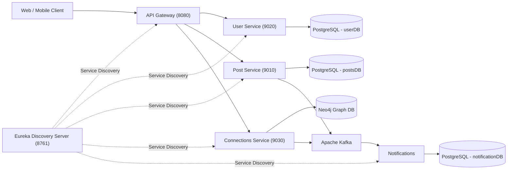
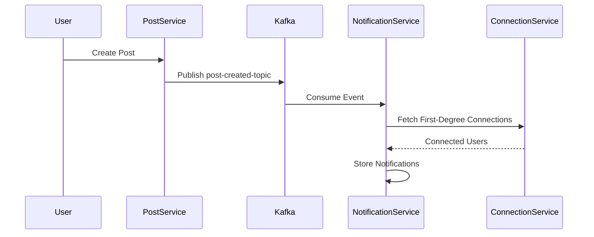
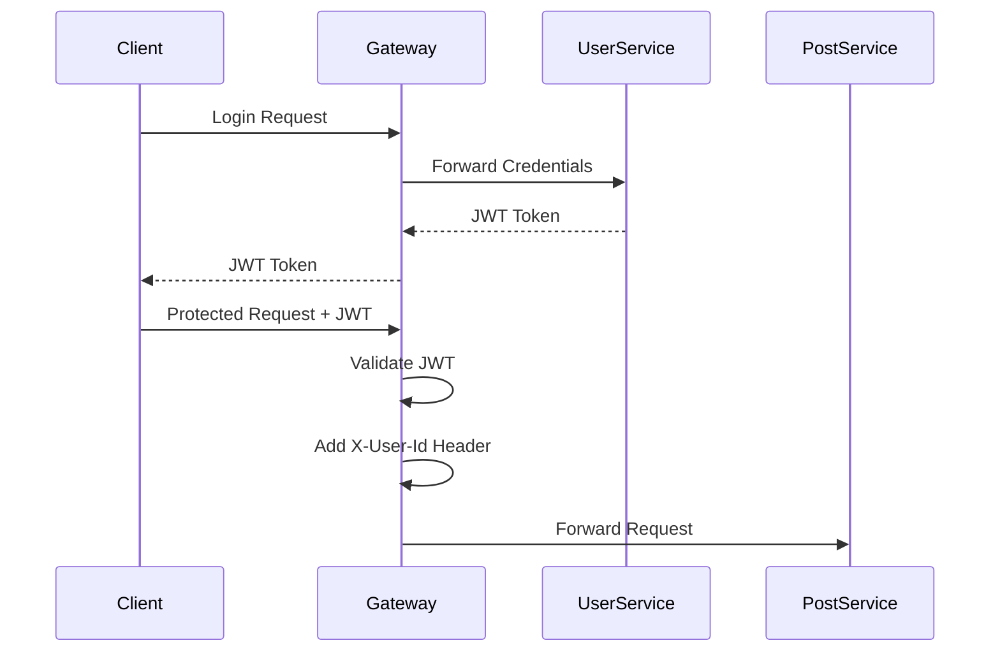

# 🌐 Sociofy

<p align="center">
  <b>A scalable backend for a social networking application built using Spring Boot Microservices.</b>
</p>

<p align="center">
  
  
  
  
  
  
</p>

---

## 📖 Overview

**Sociofy** is the backend of a social networking platform where users can:

- 👤 Create accounts and authenticate with JWT.
- 📝 Publish posts.
- ❤️ Like and unlike posts.
- 🤝 Send, accept, and reject connection requests.
- 🔔 Receive notifications for social activity.

The application follows a **Microservices Architecture** where each service owns its own business capability and database.

Communication happens through:

- **Synchronous REST APIs** (immediate responses)
- **Asynchronous Kafka Events** (notifications and side effects)

---

# 🏗️ High-Level Architecture



---

# 🚀 What the Application Does

A typical user journey looks like this:

| Step | Action |
|------|--------|
| 1 | User signs up. |
| 2 | User logs in and receives a JWT token. |
| 3 | Authenticated user creates posts. |
| 4 | Users like/unlike posts. |
| 5 | Users manage connection requests. |
| 6 | Notification service generates notifications through Kafka events. |

---

# 🧩 Microservices

| Service | Responsibility | Database | Port |
|----------|---------------|----------|------|
| **API Gateway** | Routing, JWT validation, authentication filter | — | `8080` |
| **Discovery Server** | Eureka service registry | — | `8761` |
| **User Service** | Signup, login, user management, JWT generation | PostgreSQL | `9020` |
| **Post Service** | Create/read posts and likes | PostgreSQL | `9010` |
| **Connections Service** | Social graph and connection requests | Neo4j | `9030` |
| **Notification Service** | Kafka consumer and notification storage | PostgreSQL | `9040` |

---

# 🔀 Request Flow

Clients interact **only with the API Gateway**.

```text
Client
   │
   ▼
API Gateway
   │
   ├── Validate JWT
   ├── Extract User ID
   ├── Add X-User-Id Header
   ▼
Target Microservice
```

Gateway responsibilities:

- Route incoming requests.
- Validate Bearer JWT.
- Add authenticated user ID in `X-User-Id`.
- Forward request using Eureka discovery.

---

# 📡 Event Flow (Kafka)



The notification service performs all notification generation asynchronously.

---

# 🔐 Authentication Flow



---

# 📂 API Endpoints

Base URL through Gateway:

```text
http://localhost:8083
```

---

## Authentication APIs

| Method | Endpoint | Authentication |
|--------|----------|----------------|
| POST | `/api/v1/users/auth/signup` | ❌ |
| POST | `/api/v1/users/auth/login` | ❌ |

Login returns:

```http
Authorization: Bearer <JWT_TOKEN>
```

---

## Posts APIs

| Method | Endpoint |
|--------|----------|
| POST | `/api/v1/posts/core` |
| GET | `/api/v1/posts/core/{postId}` |
| GET | `/api/v1/posts/core/users/{userId}/allPosts` |
| POST | `/api/v1/posts/likes/{postId}` |
| DELETE | `/api/v1/posts/likes/{postId}` |

Requires JWT.

---

## Connections APIs

| Method | Endpoint |
|--------|----------|
| GET | `/api/v1/connections/core/{userId}/first-degree` |
| POST | `/api/v1/connections/core/request/{userId}` |
| POST | `/api/v1/connections/core/accept/{userId}` |
| POST | `/api/v1/connections/core/reject/{userId}` |

Requires JWT.

---

# ⚙️ Important Workflows

## 1️⃣ Signup & Login

```text
Client
   │
   ▼
Gateway
   │
   ▼
User Service
   │
   ├── Hash Password (BCrypt)
   ├── Store User
   └── Generate JWT
```

---

## 2️⃣ Create a Post

```text
Client
   │
   ▼
Gateway (JWT Validation)
   │
   ▼
Post Service
   │
   ├── Save Post
   └── Publish Kafka Event
            │
            ▼
Notification Service
            │
            └── Notify Connections
```

---

## 3️⃣ Like a Post

```text
Client
   │
   ▼
Gateway
   │
   ▼
Post Service
   │
   ├── Save Like
   └── Publish post-liked-topic
            │
            ▼
Notification Service
            │
            └── Notify Post Creator
```

---

## 4️⃣ Connection Management

```text
Client
   │
   ▼
Connections Service
   │
   ├── Send Request
   ├── Accept Request
   └── Reject Request
          │
          ▼
        Kafka
          │
          ▼
Notification Service
```

---

# 📬 Kafka Topics

| Topic | Producer | Consumer | Purpose |
|--------|----------|----------|---------|
| `post-created-topic` | Post Service | Notification Service | New post created |
| `post-liked-topic` | Post Service | Notification Service | Post liked |
| `send-connection-request-topic` | Connections Service | Notification Service | Connection request sent |
| `accept-connection-request-topic` | Connections Service | Notification Service | Connection request accepted |

---

# 🗄️ Database Architecture

Sociofy follows the **Database per Service** pattern.

| Service | Database |
|----------|----------|
| User Service | PostgreSQL (`userDB`) |
| Post Service | PostgreSQL (`postsDB`) |
| Connections Service | Neo4j |
| Notification Service | PostgreSQL (`notificationDB`) |

Benefits:

- Independent schemas.
- Loose coupling.
- Better scalability.
- Service autonomy.

---

# 🛠️ Tech Stack

## Backend

- Java 21
- Spring Boot
- Spring MVC
- Spring Data JPA
- Spring Data Neo4j
- Spring Security
- Lombok
- ModelMapper
- Maven

## Microservices

- Spring Cloud Gateway
- Netflix Eureka
- Spring Cloud LoadBalancer
- OpenFeign
- JWT Authentication
- BCrypt Password Encoding

## Infrastructure

- PostgreSQL 16
- Neo4j
- Apache Kafka
- Docker
- Docker Compose

---

# 📁 Repository Structure

```text
Sociofy
│
├── api-gateway/              # Gateway & JWT Filter
├── discovery-server/          # Eureka Registry
├── User-Service/              # Authentication & Users
├── post-Service/              # Posts & Likes
├── connections-service/       # Social Graph
├── notification-service/      # Kafka Consumers
│
└── docker-compose.yml         # Local Infrastructure
```

Each service follows a standard Spring Boot project structure.

```text
src
├── controller
├── service
├── repository
├── entity
├── dto
├── config
├── security
└── resources
```

---

# 🐳 Running with Docker Compose

## Prerequisites

- Docker Desktop
- Docker Compose

Required ports:

| Service | Port |
|----------|------|
| Gateway | `8083` |
| Eureka | `8761` |
| Kafka | `9092` |
| Neo4j Browser | `7474` |
| Neo4j Bolt | `7687` |
| Notification DB | `5432` |
| Posts DB | `5433` |
| User DB | `5434` |

---

## Start Everything

```bash
docker compose up -d
```

View logs:

```bash
docker compose logs -f api-gateway
```

Stop services:

```bash
docker compose down
```

Remove volumes:

```bash
docker compose down -v
```

---

# 🌍 Local URLs

| Component | URL |
|-----------|-----|
| API Gateway | `http://localhost:8083` |
| Eureka Dashboard | `http://localhost:8761` |
| Neo4j Browser | `http://localhost:7474` |
| Kafka Broker | `localhost:9092` |

---

# 💻 Running Individual Services

Move inside any service directory.

### Linux / macOS

```bash
./mvnw spring-boot:run
```

### Windows

```powershell
.\mvnw.cmd spring-boot:run
```

Package service:

```powershell
.\mvnw.cmd clean package
```

When running services without Docker, update:

- PostgreSQL host
- Kafka host
- Eureka host

inside `application.yml` or `application.properties`.

---

# 🧪 Running Tests

Each service contains its own Maven test suite.

```powershell
.\mvnw.cmd test
```

Integration tests may require:

- PostgreSQL
- Neo4j
- Kafka
- Eureka

or TestContainers/mocks.

---

# 📌 Current Development Notes

- Neo4j and notification database credentials are configured consistently between Docker Compose and their services.
- Feign clients use the connections controller mapping `/core/{userId}/first-degree`.
- JWT secrets and database passwords should be moved to environment variables for production deployments.
- Kafka is configured as a single broker for local development.

---

# 🎯 Design Highlights

- API Gateway handles authentication and routing.
- Eureka provides dynamic service discovery.
- Kafka enables asynchronous event-driven communication.
- PostgreSQL stores relational business data.
- Neo4j manages user relationship graphs.
- Notification Service is completely decoupled from user-facing requests.

---

# 👨‍💻 Author

**Jayant Kumar**

Backend Developer • Spring Boot • Microservices • Kafka • PostgreSQL • Neo4j